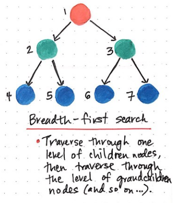
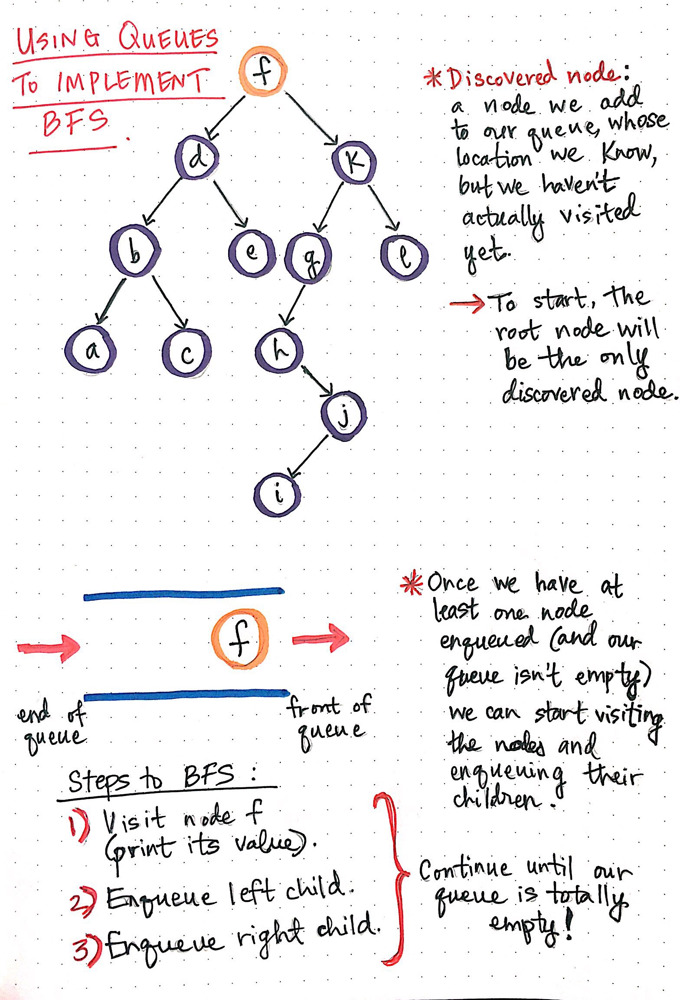
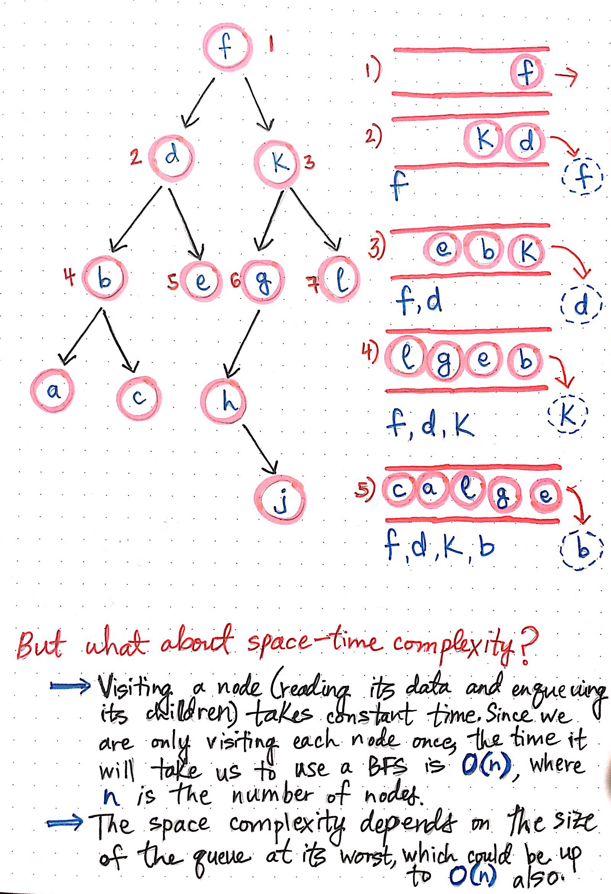

# Breadth First Traversal for Binary Tree

    

 

**Breadth-first search** involves search through a tree one level at a time.

> We traverse through one entire level of children nodes first, before moving on to traverse through the grandchildren nodes. And we traverse through an entire level of grandchildren nodes before going on to traverse through great-grandchildren nodes.

 

### Queues to the rescue!

BFS leans on the _queue data structure_. The nice thing about using queues is that it solves the very problem we discovered earlier: it allows us to keep a reference to nodes that we want to come back to, even though we haven’t checked/visited them yet.

> We add nodes that we have discovered — but not yet visited — to our queue, and come back to them later.

A common term for nodes that we add to our queue is **discovered nodes**; a discovered node is one that we add to our queue, whose location we know, but we have yet to actually visit. In fact, this is exactly what makes a queue the perfect structure for solving the BFS problem.

     
    Using queues to implement breadth-first search

 

In the graph to the left, we start off by adding the root node to our queue, since that’s the only node we ever have access to (at least, initially) in a tree. This means that **the root node is the only discovered node to start**.

Once we have at least one node enqueued, we can start the process of visiting nodes, and adding references to their children nodes into our queue.

Okay, so this all might sound a little bit confusing. And that’s okay! I think it’ll be a lot easier to grasp if we break it down into simpler steps.

For every node in our queue — always starting with the root node — we’ll want to do three things:

1. **Visit** the node, which usually just means printing out its value.
2. **Add** the node’s **left child** to our queue.
3. **Add** the node’s **right child** to our queue.

Once we do these three things, we can remove the node from our queue, because we don’t need it anymore! We basically need to keep doing this repeatedly until we get to the point where our queue is empty.

Okay, let’s look at this in action!

In the graph below, we start off with the root node, node _f_, as the only discovered node. Remember our three steps? Let’s do them now:

1. We’ll visit node _f_ and print out its value.
2. We’ll enqueue a reference to its left child, node _d_.
3. We’ll enqueue a reference to its right child, node _k_.

And then, we’ll remove node _f_ from our queue!

     
    Growing the queue structure in a breadth-first search implementation

 

The next node at the front of the queue is node _d_. Again, same three steps here: print out its value, add its left child, add its right child, and then remove it from the queue.

Our queue now has references to nodes _k_, _b_, and _e_. If we keep repeating this process systematically, we’ll notice that we’re actually traversing the graph and printing out the nodes in _level order_. Hooray! That’s exactly what we wanted to do in the first place.

> The key to this working so well is the very nature of the queue structure. Queues follow the first-in, first-out (FIFO) principle, which means that whatever was enqueued first is the first item that will be read and removed from the queue.

Lastly, while we’re on the topic of queues, it’s worth mentioning that the space-time complexity of a BFS algorithm is _also_ related to the queue that we use to implement it — who knew that queues would come back to be so useful, right?

The time complexity of a BFS algorithm depends directly on how much time it takes to visit a node. Since the time it takes to read a node’s value and enqueue its children doesn’t change based on the node, we can say that visiting a node takes constant time, or, _O(1)_ time. Since we only visit each node in a BFS tree traversal exactly once, the time it will take us to read every node really just depends on how many nodes there are in the tree! If our tree has 15 nodes, it will take us O(15); but if our tree has 1500 nodes, it will take us O(1500). Thus, the time complexity of a breadth-first search algorithm takes linear time, or **O(n)**, where ***n*** is the number of nodes in the tree.

Space complexity is similar to this, has more to do with how much our queue grows and shrinks as we add the nodes that we need to check to it. In the worst case situation, we could potentially be enqueuing all the nodes in a tree if they are all children of one another, which means that we could possibly be using as much memory as there are nodes in the tree. If the size of the queue can grow to be the number of nodes in the tree, the space complexity for a BFS algorithm is also linear time, or **O(n)**, where ***n*** is the number of nodes in the tree.
