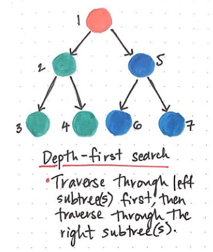
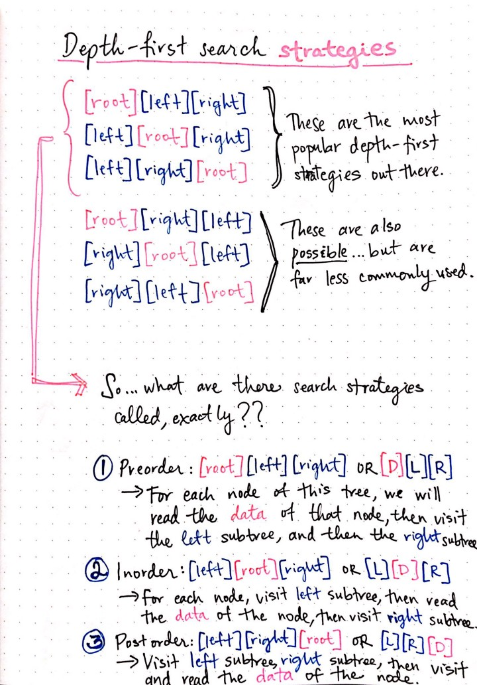
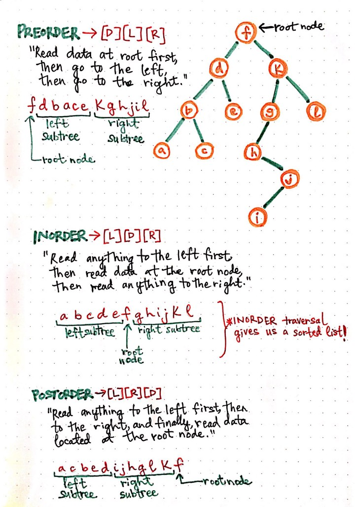
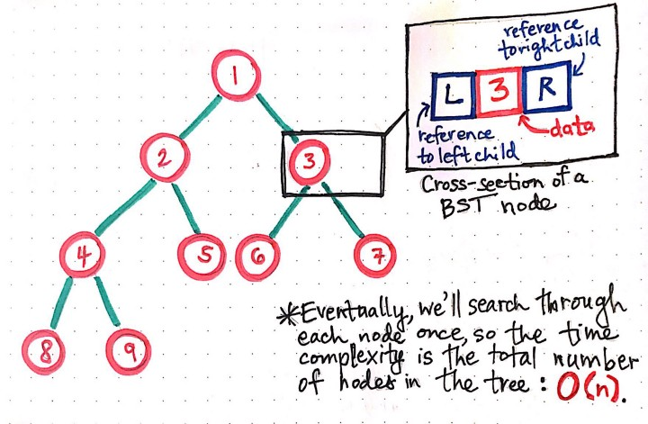
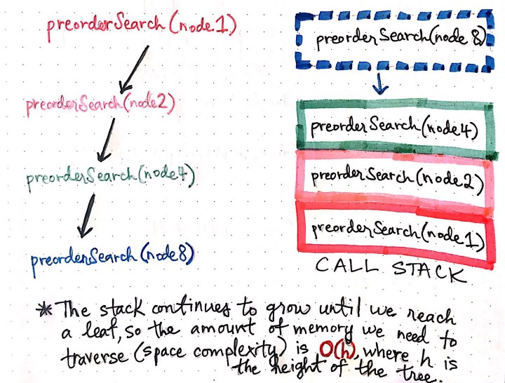

# Depth First Traversal for Binary Tree

    

 

In the graph above, we can see that, instead of traversing level by level, we’re instead traversing through the tree by visiting all of the children, grandchildren, great-grandchildren (and so on) until we come to the end of a path. Then — and only then — do we make our way back up the levels and start on a new path. We walk the path and visit all of the nodes in red first, and then move on to visit the nodes in orange next.

> In depth-first search, once we start down a path, we don’t stop until we get to the end. In other words, we traverse through one branch of a tree until we get to a leaf, and then we work our way back to the trunk of the tree.

 

### This tree was so deep, I almost drowned

There are a few different ways that we could search through the children, grandchildren, and great-grandchildren nodes of a tree. And really, it all comes down to the order in which we decide to do things.

You might remember that, in addition to containing some piece of data, a node in a binary tree can only ever have two references: a reference to the node on its left (which will be smaller in its data), and a reference to the node on its right (which will be larger in its data). We already know that whenever we search through a tree, we’re trying to either _check_ or _update_ all the nodes in the structure.

In both of these cases, we need to do three things:

1. Read the **data** of the node that we’re checking or updating.
2. Check the node to the **left** of the node (the left reference) that we’re on currently.
3. Check the node to the **right** of the node (the left reference) that we’re on currently.

The different depth-first strategies all revolve around the order in which we do these three things.

     
    Depth-first search strategies

 

Since there are three things we have to do each time we visit/check a node, there are six possible permutations for the order in which we can do these things, which I’ve drawn out in the image to the left.

However, of these six permutations, the first three are the most popular — and also the most common. They’re so ubiquitous, in fact, that they have special names!

The first of these common DFS strategies goes something like this: a) read the data of the node that we’re on, b) visit node that is referenced to the left, if it exists, and c) visit node that is referenced to the right, if it exists. The process of reading data, and then visiting the left node followed by the right node is often written in short form as **DLR**, where **D** stands for data, **L** stands for left node, and **R** stands for right node.

We use this shorthand in order to describe the order in which we’ll do our checking. So, I told you that these three strategies had special names, right? I guess I should probably tell you what they are:
1. **Preorder (DLR)**: Read the data of the node, then visit the left subtree/nodes, followed by the right subtree/nodes.
2. **Inorder (LDR)**: Visit the left subtree/nodes, then read the data of the node, and finally visit the right subtree/nodes.
3. **Postorder (LRD)**: Visit the left subtree/nodes, then visit the right subtree/nodes, and finally read the data of the node.

Okay. All of these definitions might seem like an awful lot of information to take in at once. I think it’ll be a lot easier — and hopefully, a bit clearer — with a drawing! Let’s take a closer look at what preorder, inorder, and postorder traversal look like using an example tree.

In the image below, we’re trying out all three of these techniques on a binary tree that has 12 nodes in total. This is what each of these traversals would look like if we were printing out the name of each node as we visited it:

     
    Preorder, inorder, and postorder traversal techniques. [EDIT: Please note that the INORDER traversal here. should read: “a, b, c, d, e, f, h, i, j, g, k, l”. Since you need to traverse through the left subtree first, we should be printing/checking node h before g, and then checking the left subtree of its children, or node i. Only after checking the left nodes/subtrees can we check node j, and then work our way back up to node g, k, and l. Sorry about the mistake here!]

 

Interesting! If we look at how these three traversals work, we’ll notice pretty quickly that the whole “DLR” short form actually carries significant weight.

In _preorder traversal_, for example, we’re reading the data at the node first, then moving on to the left subtree, and then to the right subtree. As such, the nodes that we visit (and as we print out their data), follow that pattern: first we print out the root node’s data, then the data from the left subtree, and then the data from the right subtree.

However, in _inorder traversal_, we’re following the path all the way down to the leftmost leaf, and then making our way back to the root node, before following the path down to the rightmost leaf. Inorder traversal is particularly cool because we end up with a sorted list of nodes!

Finally, in _postorder traversal_, we visit the left node reference first, then the right node, and then if none exist, we read the data of the node that we’re currently on. This is why we read the data of node _a_, followed by node _c_, before reading the data of node _b_. We end up reading the root node at the very end of the traversal (after visiting all the nodes in the left subtree and the right subtree), which matches the shorthand for postorder traversal: LRD.

 

### Going (even) deeper with recursion

Okay, so we have three different methods of implementing depth-first search.

That’s cool, I guess.

But…how do we actually go about _implementing_ any of these strategies? Why, by using recursion, of course!

Just in case you just need a quick refresher: **recursion** is the process of calling a method from within that very same method — and effectively repeating an action again and again.

You might have already seen how the depth-first strategy could be implemented as a recursive method. If you think about it, it starts to become more and more clear: we’re doing the same thing — reading data, checking a left node reference, and checking a right node reference — again and again, until we get through all of the nodes in the tree. Sure, sometimes we’re doing these three actions in a _slightly_ different order, depending upon which strategy we chose — but still, we’re doing the same three things, in the same order, with each node that we visit.

We can implement this recursively by first considering what each of these nodes might look like in the context of our code. Here’s a little cross-section of a binary search tree’s node to help you visualize:

     
    Cross-section of a binary search tree node

 

Each node has three parts — data, a left reference, and a right reference. Immediately off the bat, we can already see one thing pretty clearly: we’re going to have to repeat the action of “reading” these three parts of a node for _each node_ in the tree.

> Thus, the amount of time it’s going to take us to traverse through a tree using DFS is directly proportional to the number of nodes in the tree. The time complexity of using breadth-first search on a binary tree is O(n), where n is the number of nodes in the tree.

If we have 5 nodes, it’ll take us O(5), and if we have 50 nodes to visit, it’ll take us O(50) in terms of time. That’s not too bad! Shall we take it a step further?

Alright, that wasn’t as bad as I was expecting either! All we did was transform the **DLR** shorthand for the preorder traversal into code. This function takes in a node, and checks that the node exists. Then, it reads the **data** of the node, and does a preorder search of the **left** node reference, followed by a preorder search of the **right** node reference.

Whoa! Recursion in action. Is your mind spinning yet?

Okay, okay, stay with me, because this recursion magic actually sheds light on one more important thing: the time complexity of depth-first search. We know that the amount of _time_ that a DFS takes corresponds directly to how big a tree is — specifically, how many nodes it has, because that’s how many nodes we need to visit, which will directly impact how much time it will take for us to traverse the whole tree!

But what about the _space_ complexity? Well, because DFS is usually implemented recursively, this ends up with us calling one function from within itself, many times. Let’s look back at our cross-section example tree. If we were implementing preorder search, we would traverse from node 1 to 2, from 2 to 4, and from node 4 to 8. Each time that we visited one of these nodes, we would be invoking the `preorderSearch` function from within the first function we called when we passed in the root node.

Why is this important? Well, because of the **call stack**. You might remember that stacks operate according to the last-in, first-out principle. This means that only when the last function finishes running and returns can we start popping functions that are _currently taking up space_ from off of the top of the stack.

     
    Recursive implementation of depth-first search

 

This means that our call stack will continue to grow until we reach a leaf node.

> Once we reach a leaf node, our `preorderSearch` function will `return` because we will pass it references to a `left` and a `right` node that simply won’t exist!

And then each of the “open” functions in our call stack will start to return and close up, until we get back down to the first function we called to start off with. This is important to understand because it exemplifies the _space complexity_ of depth-first search — namely, that the amount of space we need in terms of memory depends upon the height of our tree, or **O(h)**. The height of the tree will tell us how much memory we’ll need in the deepest recursive function call, which will tell us the worst-case scenario for running a depth-first search algorithm.

When we take a step back, this is actually pretty powerful — we can learn so much about the strengths (and weaknesses!) of an algorithm just by looking at a data structure! And since we already know where trees are used — in `git bisect` commands, for example, and in implementing complex structures, like mazes — we can understand how easy or hard it would be to search through them using DFS, with one simple glance.

I don’t know about you, but I’d say that we’re well on our way to becoming algorithm wizards!
